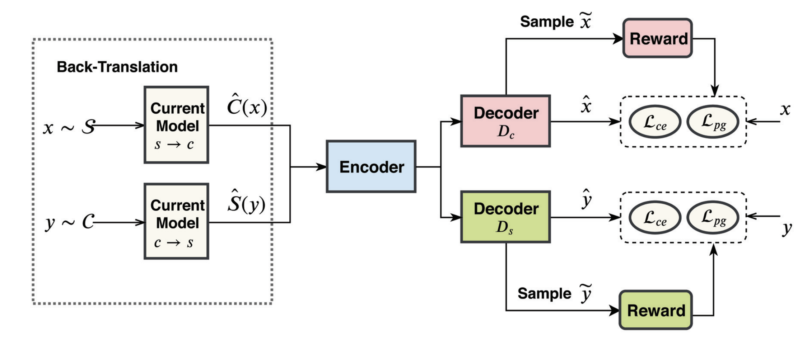

# BTTS: Semi-Supervised Text Simplification

This is the original implementation of the AAAI 2020 paper: <a href="https://arxiv.org/pdf/2004.14693.pdf"> Semi-Supervised Text Simplification with Back-Translation and Asymmetric Denoising Autoencoders </a>

## Model Sturcture

## Training

### Step 1 : Data and Resource Preparing
The Non-parallel data is provided by <a href="https://arxiv.org/pdf/1810.07931.pdf"> Surya et al. (2018) </a>. You can download it from <a href="https://github.com/subramanyamdvss/UnsupNTS"> here </a>.

Extract complex and simple sentences into directory `data/non_parallel`. If you want to train in a Semi-Supervised mode, you can put several parallel data such as Wiki-Large or Newsela  into `data/parallel`. We provide several examples in the `data` directory.

Download `resource.zip` from <a href="https://drive.google.com/file/d/1h0mLUWVMK0pyZBIL6Ak-6PQYe2j1Y5NL/view?usp=sharing"> here </a> and extract `resource.zip` has :

- Substitution rules extract from SimplePPDB
- A pretrained BPE embedding with Fasttext
- A pretrained Language model for reward calculation

### Step 2 : Train the back-translation model
Train the model using 

	bash run.sh

If you want to use reinforcement learning to finetue the model, make sure you set RL_FINTUNE=1 in `run.sh`

In our experiments, we use 1 gpu for training, and several gpus for back-translation. So you should have at least 2 gpus to conduct our experiments. You can use `--otf_num_processes` to adjust the gpu numbers for back-translation.

### Step 3 : Translate
 
	bash translate.sh

to generate simplified sentences for evaluation. We use the test set in Nesela and Wiki-Large in our experiment.	

### Step 4 : Evaluate

	bash eval.sh
	
	
## About Corpus-Level SARI

For corpus level SARI, the original script provided by <a href="https://github.com/cocoxu/simplification"> Xu et
al. (2016) </a> is only for 8 references WikiLarge dataset. Several previous works misused the original
scripts on the 1 reference dataset which may lead to a very low score. As a result, we provide a python version for corpus level SARI in `metrics/STAR.py`, which can get the same result compared with the original script on Wiki-Large dataset and correct result on 1 reference Newsela dataset.
